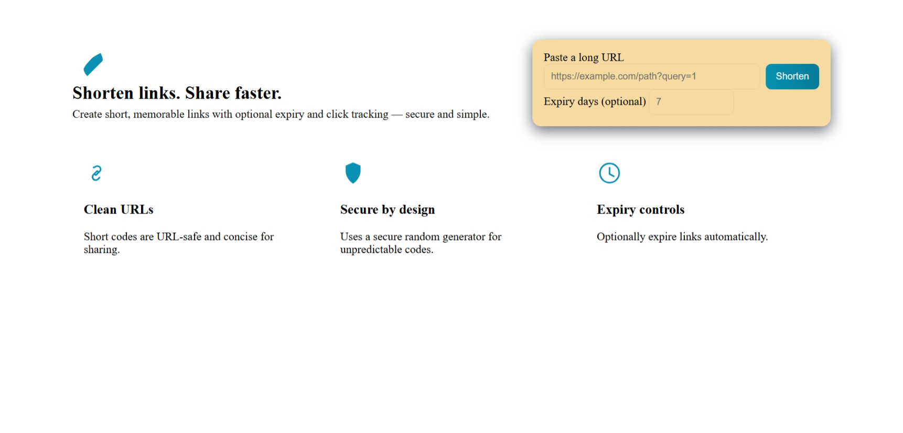

# 🔗 Day 02: URL Shortener (Python / Flask)



A modern, secure, and scalable URL shortener built with Flask, SQLAlchemy, and SQLite.

## ✨ Features
- 🔗 Shorten any long URL to a memorable code
- 📊 Track clicks and analytics for every link
- ⏳ Set optional expiry dates for links
- 🖥️ Beautiful, responsive frontend with copy-to-clipboard
- 🧪 Fully tested with pytest and in-memory SQLite
- 🛡️ Secure code generation and rate limiting

## 🚀 Quick Start

```powershell
cd day02-python-url-shortener
python -m venv .venv
.\.venv\Scripts\Activate.ps1
pip install -r requirements.txt
# copy .env.example to .env and edit values if needed
python scripts/init_db.py
$Env:FLASK_APP = 'app:create_app()'
$Env:FLASK_ENV = 'development'
flask run
```

Open [http://localhost:5000](http://localhost:5000) in your browser.

## 🧪 Run Tests

```powershell
cd day02-python-url-shortener
.\.venv\Scripts\Activate.ps1
pytest -q
```

## 🛠️ Tech Stack
- Python 3.x
- Flask
- SQLAlchemy
- Flask-Migrate
- Flask-Limiter
- python-dotenv
- pytest

## 📁 Project Structure
```
day02-python-url-shortener/
├── app.py
├── models.py
├── services/
│   └── shortener.py
├── api/
│   └── routes.py
├── templates/
│   └── index.html
├── static/
│   └── css/style.css
├── scripts/
│   └── init_db.py
├── tests/
│   ├── test_shortening.py
│   └── test_redirect.py
├── requirements.txt
├── .env.example
└── README.md
```

## 💡 About
This project is part of my #30DaysBackendChallenge. Each day I build a new backend project to learn, share, and grow as a developer.

---

Let’s connect if you love backend, Python, or building cool tools! 🚀

#Python #Flask #Backend #WebDevelopment #URLShortener #30DaysOfCode #DevJourney
